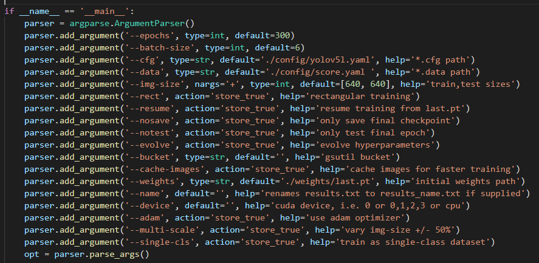
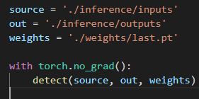

# 使用yolov5训练自己的数据集（详细过程）并通过flask部署

#### 依赖库
- torch 
- torchvision 
- numpy
- opencv-python
- lxml
- tqdm
- flask
- pillow
- tensorboard
- matplotlib
- pycocotools

#### Windows，请使用 pycocotools-windows 代替 pycocotools


### 1.准备数据集

这里以PASCAL VOC数据集为例，[提取码： 07wp](https://pan.baidu.com/s/1u8k9wlLUklyLxQnaSrG4xQ)
将获取的数据集放到datasets目录下
数据集结构如下：
```
---VOC2012
--------Annotations
---------------xml0
---------------xml1
--------JPEGImages
---------------img0
---------------img1
--------pascal_voc_classes.txt
```
Annotations为所有的xml文件，JPEGImages为所有的图片文件，pascal_voc_classes.txt为类别文件。

#### 获取标签文件
yolo标签文件的格式如下：
```
102 0.682813 0.415278 0.237500 0.502778
102 0.914844 0.396528 0.168750 0.451389

第一位 label，为图片中物体的类别
后面四位为图片中物体的位置，（xcenter, ycenter, h, w）即目标物体中心位置的相对坐标和相对高宽
上图中存在两个目标
```
如果你已经拥有如上的label文件，可直接跳到下一步。
没有如上标签文件，可使用 [labelimg  提取码  dbi2](https://pan.baidu.com/s/1oEFodW83koHLcGasRoBZhA) 打标签。生成xml格式的label文件，再转为yolo格式的label文件。labelimg的使用非常简单，在此不在赘述。

xml格式的label文件转为yolo格式:

```
python center/xml_yolo.py
```

pascal_voc_classes.txt，为你的类别对应的json文件。如下为voc数据集类别格式。
```python
["aeroplane","bicycle", "bird","boat","bottle","bus","car","cat","chair","cow","diningtable","dog","horse","motorbike","person","pottedplant","sheep","sofa","train", "tvmonitor"]
```
####  运行上面代码后的路径结构
```
---VOC2012
--------Annotations
--------JPEGImages
--------pascal_voc_classes.json
---yolodata
--------images
--------labels
```

### 2.划分训练集和测试集
训练集和测试集的划分很简单，将原始数据打乱，然后按 9  ：1划分为训练集和测试集即可。代码如下：

```
python center/get_train_val.py
```
##### 运行上面代码会生成如下路径结构
```
---VOC2012
--------Annotations
--------JPEGImages
--------pascal_voc_classes.json
---yolodata
--------images
--------labels
---traindata
--------images
----------------train
----------------val
--------labels
----------------train
----------------val
```
##### traindata就是最后需要的训练文件

### 3. 训练模型

yolov5的训练很简单，本文已将代码简化，代码结构如下：

```
dataset             # 数据集
------traindata     # 训练数据集
inference           # 输入输出接口
------inputs        # 输入数据
------outputs       # 输出数据
config              # 配置文件
------score.yaml    # 训练配置文件
------yolov5l.yaml  # 模型配置文件
models              # 模型代码
runs	            # 日志文件
utils               # 代码文件
weights             # 模型保存路径，last.pt，best.pt
train.py            # 训练代码
detect.py           # 测试代码
```

score.yaml解释如下：
```
# train and val datasets (image directory)
train: ./datasets/traindata/images/train/
val: ./datasets/traindata/images/val/
# number of classes
nc: 2
# class names
names: ['苹果','香蕉']
```

- train:   为图像数据的train，地址
- val:     为图像数据的val，地址
- nc:      为类别个数
- names:   为类别对应的名称


##### yolov5l.yaml解释如下：

```
nc: 2 # number of classes
depth_multiple: 1.0  # model depth multiple
width_multiple: 1.0  # layer channel multiple
anchors:
  - [10,13, 16,30, 33,23]  # P3/8
  - [30,61, 62,45, 59,119]  # P4/16
  - [116,90, 156,198, 373,326]  # P5/32
backbone:
  # [from, number, module, args]
  [[-1, 1, Focus, [64, 3]],  # 1-P1/2
   [-1, 1, Conv, [128, 3, 2]],  # 2-P2/4
   [-1, 3, Bottleneck, [128]],
   [-1, 1, Conv, [256, 3, 2]],  # 4-P3/8
   [-1, 9, BottleneckCSP, [256]],
   [-1, 1, Conv, [512, 3, 2]],  # 6-P4/16
   [-1, 9, BottleneckCSP, [512]],
   [-1, 1, Conv, [1024, 3, 2]], # 8-P5/32
   [-1, 1, SPP, [1024, [5, 9, 13]]],
   [-1, 6, BottleneckCSP, [1024]],  # 10
  ]
head:
  [[-1, 3, BottleneckCSP, [1024, False]],  # 11
   [-1, 1, nn.Conv2d, [na * (nc + 5), 1, 1, 0]],  # 12 (P5/32-large)
   [-2, 1, nn.Upsample, [None, 2, 'nearest']],
   [[-1, 6], 1, Concat, [1]],  # cat backbone P4
   [-1, 1, Conv, [512, 1, 1]],
   [-1, 3, BottleneckCSP, [512, False]],
   [-1, 1, nn.Conv2d, [na * (nc + 5), 1, 1, 0]],  # 17 (P4/16-medium)
   [-2, 1, nn.Upsample, [None, 2, 'nearest']],
   [[-1, 4], 1, Concat, [1]],  # cat backbone P3
   [-1, 1, Conv, [256, 1, 1]],
   [-1, 3, BottleneckCSP, [256, False]],
   [-1, 1, nn.Conv2d, [na * (nc + 5), 1, 1, 0]],  # 22 (P3/8-small)
   [[], 1, Detect, [nc, anchors]],  # Detect(P3, P4, P5)
  ]
```
- nc：为目标类别个数
- depth_multiple 和 width_multiple：控制模型深度和宽度。不同的参数对应：s，m，l，x 模型。
- anchors: 为对输入的目标框通过k-means聚类产生的基础框，通过这个基础框去预测目标的box。
- yolov5会自动产生anchors，yolov5采用欧氏距离进行k-means聚类，再使用遗传算法做一系列的变异得到最终的anchors。但是本人采用欧氏距离进行k-means聚类得到的效果不如采用 1 - iou进行k-means聚类的效果。如果想要 1 - iou 进行k-means聚类源码请私聊我。但是效果其实相差无几。
- backbone: 为图像特征提取部分的网络结构。
- head:    为最后的预测部分的网络结构


#####train.py配置十分简单：


我们仅需修改如下参数即可
```
epoch:         控制训练迭代的次数
batch_size     输入迭代的图片数量
cfg:           配置网络模型路径
data:          训练配置文件路径
weights:       载入模型，进行断点继续训练
```
终端运行(默认yolov5l)
```
 python train.py
```
即可开始训练。

### 4. 测试模型



##### 需要需改三个参数
```
source：        需要检测的images/videos路径
out：		保存结果的路径
weights：       训练得到的模型权重文件的路径
```
##### 你也可以使用在coco数据集上的权重文件进行测试将他们放到weights文件夹下

[提取码：hhbb](https://pan.baidu.com/s/18AD8HpLhcRGSKOwGwPJMMg)

终端运行
```
 python detect.py
```
即可开始检测。

### 5.通过flask部署

flask的部署是非简单。如果有不明白的可以参考我之前的博客。

[阿里云ECS部署python,flask项目，简单易懂，无需nginx和uwsgi](https://blog.csdn.net/qq_44523137/article/details/112676287?spm=1001.2014.3001.5501)

[基于yolov3-deepsort-flask的目标检测和多目标追踪web平台](https://blog.csdn.net/qq_44523137/article/details/116323516?spm=1001.2014.3001.5501)


终端运行
```
 python app.py
```
即可开始跳转到网页，上传图片进行检测。


